# Claude Code Launch 架构设计

> **文档定位**：完整记录系统的技术实现，包含代码结构、数据库设计、接口清单、数据存储映射等所有细节，供开发者理解系统和 AI 做需求分解与概要设计时作为上下文信息源。
>
> 业务语言描述请参阅 [领域模型文档](./domain-model.md)。

---

## 系统架构总览

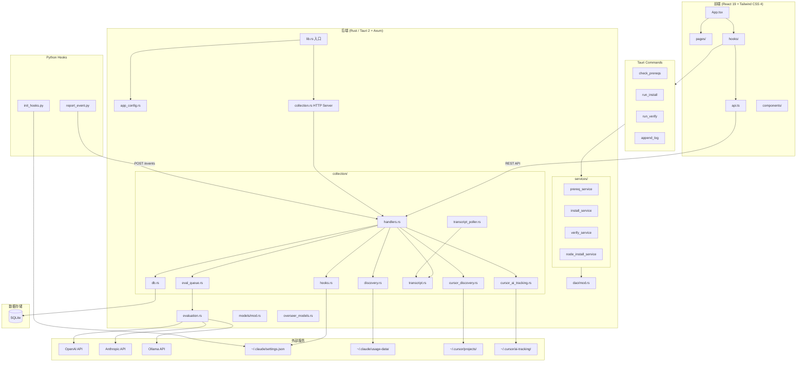

---

## 技术栈

| 层 | 技术 | 版本 |
|---|---|---|
| 前端框架 | React + TypeScript | 19.1 / 5.8 |
| 前端样式 | Tailwind CSS + shadcn | 4.2 / 4.0 |
| 前端构建 | Vite | 7.0 |
| 桌面框架 | Tauri | 2.x |
| 后端语言 | Rust | stable |
| HTTP 框架 | Axum | 0.8 |
| 异步运行时 | Tokio | 1.x |
| 数据库 | SQLite (rusqlite) | 0.37 |
| HTTP 客户端 | reqwest | 0.12 |
| 文件监听 | linemux | 0.3 |
| Hooks 脚本 | Python 3 | — |

---

## 1. 安装向导

**业务目标**：帮助用户一键完成 Claude Code 的安装与验证。

### 核心实体

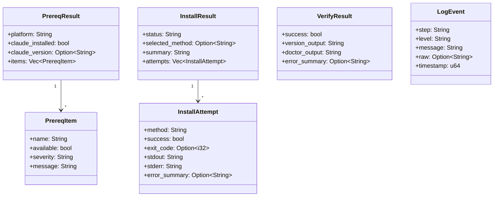

### 枚举/状态说明

| 枚举/类型 | 值 | 说明 |
|-----------|-----|------|
| SetupPhase | idle, running, success, failed | 安装页面阶段 |
| severity | blocker, warning | 检测项严重程度 |
| status | success, failed | 安装结果状态 |
| level | info, error, warn | 日志级别 |

### 服务类与关键方法

| 类/模块 | 方法签名 | 功能 |
|---------|----------|------|
| `prereq_service` | `check_prereqs() -> PrereqResult` | 检测平台、npm、Claude 版本及 Git（Windows） |
| `install_service` | `run_install<F>(emit_log: F) -> InstallResult` | 确保 npm 可用后执行 `npm install -g @anthropic-ai/claude-code` |
| `verify_service` | `run_verify<F>(emit_log: F) -> VerifyResult` | 执行 `claude --version` 验证 |
| `node_install_service` | `ensure_npm_available<F>(emit_log: &F) -> Option<String>` | Windows 下 npm 不可用时下载并静默安装 Node.js MSI |
| `dao` | `run_command_with_streaming_logs_timeout(...)` | 执行子进程并流式推送日志 |
| `dao` | `command_exists(cmd: &str) -> bool` | 检测命令是否在 PATH 中 |
| `dao` | `download_file(...)` | 下载文件 |

### 数据存储映射

本域无持久化存储，仅通过 Tauri Event 实时推送日志。

### 对外接口清单

| 接口类型 | 方法/路径 | 参数 | 返回值 | 功能 |
|----------|-----------|------|--------|------|
| Tauri Command | `check_prereqs` | 无 | `PrereqResult` | 环境检测 |
| Tauri Command | `run_install` | 无 | `InstallResult` | 执行安装，通过 `launch-log` 推送日志 |
| Tauri Command | `run_verify` | 无 | `VerifyResult` | 执行验证，通过 `launch-log` 推送日志 |
| Tauri Command | `append_log` | step, level, message | 无 | 追加日志并推送 `launch-log` |
| Tauri Event | `launch-log` | `LogEvent` | — | 前端订阅实时日志 |

### 依赖的外部服务

| 依赖 | 说明 |
|------|------|
| nodejs.org | Windows 下下载 Node.js MSI (v22.14.0) |
| registry.npmmirror.com | npm 镜像 |
| 系统 PATH | 命令检测与执行 |
| Windows 注册表 | 读取系统 PATH 以刷新环境变量 |

### 业务流程图

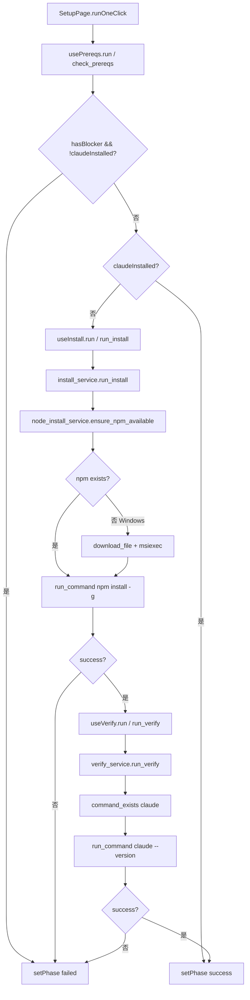

---

## 2. 会话管理

**业务目标**：统一管理 Claude Code 与 Cursor 的 AI Agent 会话。

### 核心实体与表结构

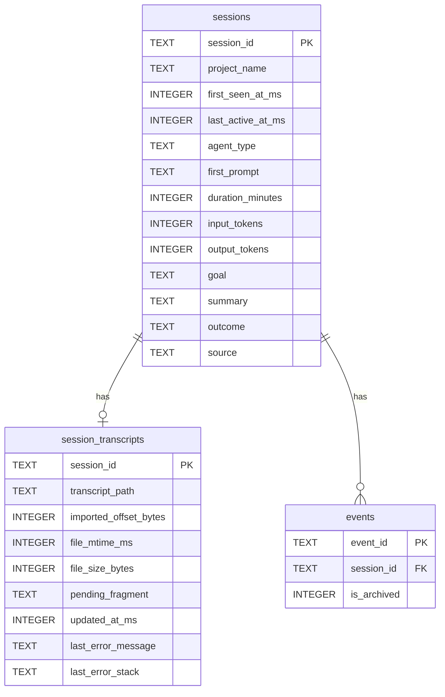

### 枚举/状态说明

| 枚举/类型 | 值 | 说明 |
|-----------|-----|------|
| agent_type | `claude-code`, `cursor` | Agent 类型 |
| source | `event`, `discovery`, `cursor-discovery` | 会话来源 |
| is_archived | 0, 1 | 事件是否已归档 |

### 服务类与关键方法

| 类/模块 | 方法签名 | 功能 |
|---------|----------|------|
| `discovery` | `scan_session_meta() -> Vec<DiscoveredSession>` | 扫描 `~/.claude/usage-data/session-meta/*.json` 及 `facets/{session_id}.json` |
| `discovery` | `import_discovered_sessions(db, sessions) -> DiscoverResult` | 将 Claude Code 会话导入/更新到 sessions 表 |
| `cursor_discovery` | `scan_cursor_sessions() -> Vec<CursorDiscoveredSession>` | 扫描 `~/.cursor/projects/{encoded_dir}/agent-transcripts/{session_id}/` |
| `cursor_discovery` | `import_cursor_sessions(db, sessions) -> CursorDiscoverResult` | 将 Cursor 会话导入/更新到 sessions 表 |
| `handlers` | `get_sessions(State) -> Json<Vec<SessionItem>>` | 查询 sessions 并关联 evaluations |
| `handlers` | `discover_sessions(State) -> Json<DiscoverResult>` | 调用 discovery 与 cursor_discovery 完成扫描与导入 |
| `handlers` | `archive_session(State, Json)` | 将 events 标记为 `is_archived=1`，清空 `session_transcripts.transcript_path` |

### 数据存储映射

| 业务概念 | SQLite 表/字段 |
|----------|---------------|
| 会话 | `sessions` (session_id, project_name, first_seen_at_ms, last_active_at_ms, agent_type, first_prompt, duration_minutes, input_tokens, output_tokens, goal, summary, outcome, source) |
| 会话 Transcript 元数据 | `session_transcripts` (session_id, transcript_path, imported_offset_bytes, ...) |
| 会话事件归档状态 | `events` (session_id, is_archived) |

### 对外接口清单

| 接口类型 | 方法/路径 | 参数 | 返回值 | 功能 |
|----------|-----------|------|--------|------|
| HTTP | GET `/sessions` | 无 | `Vec<SessionItem>` | 获取会话列表（含评估统计、风险等级） |
| HTTP | POST `/sessions/discover` | 无 | `DiscoverResult` | 扫描并导入 Claude Code 与 Cursor 会话 |
| HTTP | POST `/sessions/archive` | `{ session_id }` | `ApiErrorBody` | 归档指定会话的事件 |

### 依赖的外部服务

| 依赖 | 说明 |
|------|------|
| `~/.claude/usage-data/session-meta/*.json` | Claude Code 会话元数据 |
| `~/.claude/usage-data/facets/{session_id}.json` | 会话 goal/outcome/summary |
| `~/.claude/projects/{encoded}/` | Claude Code Transcript 文件 |
| `~/.cursor/projects/{encoded_dir}/agent-transcripts/` | Cursor 会话 Transcript 文件 |

### 业务流程图

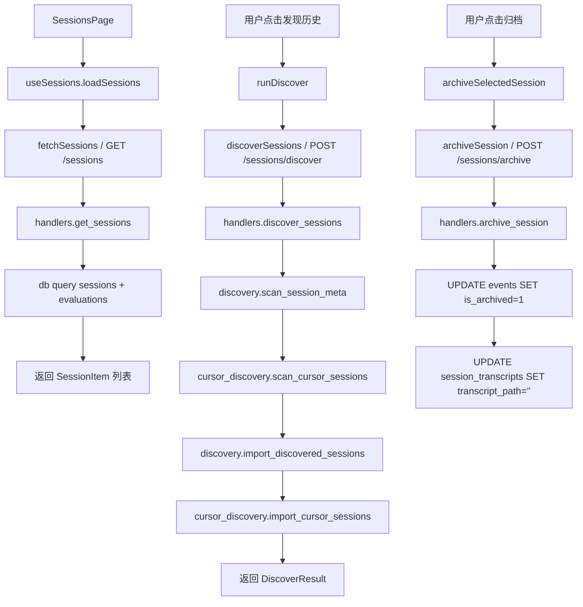

---

## 3. 事件采集

**业务目标**：采集并持久化 AI Agent 会话事件，为监控与评估提供数据。

### 核心实体

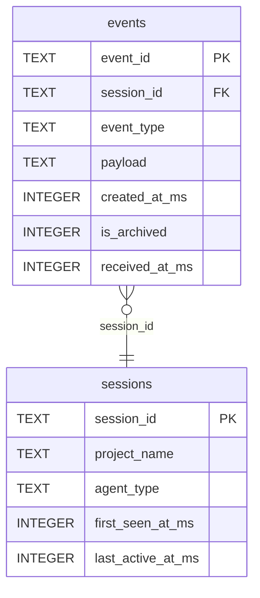

### 服务类与关键方法

| 类/模块 | 方法签名 | 功能 |
|---------|----------|------|
| `handlers` | `post_event(State, Json<IncomingEvent>)` | 校验、脱敏、投递到 `event_tx` |
| `handlers` | `get_events(State, Query<EventQuery>)` | 分页查询 events 表，过滤 `raw_stdin` |
| `db` | `persist_event(db, event)` | 写入 sessions（upsert）、events（ON CONFLICT DO NOTHING） |
| `collection` | `spawn_event_worker(...)` | 启动事件消费协程 |
| `collection` | `process_incoming_event(ctx, event)` | 持久化事件、触发 transcript 同步、入队 LLM 评估 |

### 数据存储映射

**events 表（SQLite）**

| 字段 | 类型 | 说明 |
|------|------|------|
| event_id | TEXT PK | 事件唯一标识 |
| session_id | TEXT FK | 会话标识 |
| event_type | TEXT | 事件类型 |
| payload | TEXT | JSON 载荷 |
| created_at_ms | INTEGER | 事件创建时间（毫秒） |
| is_archived | INTEGER | 0=未归档，1=已归档 |
| received_at_ms | INTEGER | 服务端接收时间 |

**索引**：`idx_events_session_time (session_id, created_at_ms DESC)`

### 对外接口清单

| 接口类型 | 方法/路径 | 参数 | 返回值 | 功能 |
|----------|-----------|------|--------|------|
| HTTP | POST `/events` | JSON: event_id, session_id, project_name, event_type, payload, created_at_ms | `EventAck` | 上报事件 |
| HTTP | GET `/events` | Query: session_id, from_ms?, to_ms?, event_type?, page?, page_size? | `EventQueryResponse` | 分页查询事件 |

### 业务流程图

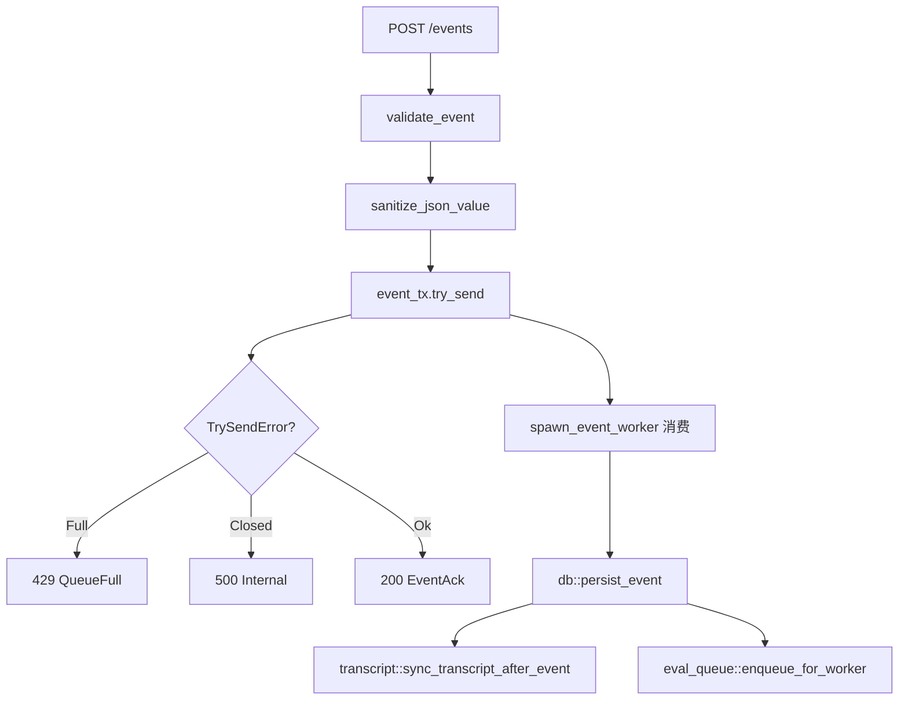

---

## 4. Transcript 同步

**业务目标**：将 Transcript JSONL 文件增量同步到 SQLite，支持实时监听与分页查询。

### 核心实体

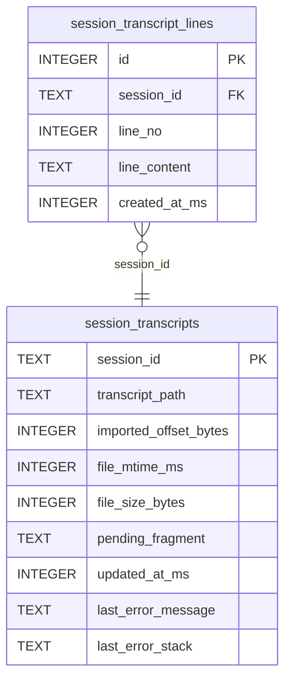

### 服务类与关键方法

| 类/模块 | 方法签名 | 功能 |
|---------|----------|------|
| `transcript` | `sync_transcript_after_event(db, tx, event)` | 从 payload 提取 transcript_path，增量读取并 upsert |
| `transcript` | `read_transcript_increment(path, existing_state?)` | 从偏移量读取，BufReader 按行解析，处理截断与 pending_fragment |
| `transcript` | `upsert_transcript_sync_state(db, session_id, path, result)` | 更新 session_transcripts，插入 session_transcript_lines |
| `transcript` | `persist_linemux_line(db, session_id, path, line)` | 将 linemux 新行写入数据库 |
| `transcript_poller` | `spawn_transcript_watcher(db, register_rx)` | 启动 linemux 监听，消费 `TranscriptRegisterRequest` |

### 数据存储映射

**session_transcripts 表**

| 字段 | 类型 | 说明 |
|------|------|------|
| session_id | TEXT PK | 会话标识 |
| transcript_path | TEXT | 源 JSONL 路径 |
| imported_offset_bytes | INTEGER | 已导入字节偏移 |
| file_mtime_ms | INTEGER | 文件修改时间 |
| file_size_bytes | INTEGER | 文件大小 |
| pending_fragment | TEXT | 未完成行缓冲 |
| updated_at_ms | INTEGER | 更新时间 |
| last_error_message | TEXT | 最近错误信息 |
| last_error_stack | TEXT | 最近错误堆栈 |

**session_transcript_lines 表**

| 字段 | 类型 | 说明 |
|------|------|------|
| id | INTEGER PK AUTOINCREMENT | 自增主键 |
| session_id | TEXT | 会话标识 |
| line_no | INTEGER | 行号 |
| line_content | TEXT | 行内容 |
| created_at_ms | INTEGER | 创建时间 |

**约束**：`UNIQUE(session_id, line_no)`
**索引**：`idx_session_transcript_lines_session (session_id, line_no)`

**文件路径规则**：仅允许 `~/.claude/projects/` 或 `~/.cursor/projects/` 下的 `.jsonl` 文件，禁止 `..`。

### 对外接口清单

| 接口类型 | 方法/路径 | 参数 | 返回值 | 功能 |
|----------|-----------|------|--------|------|
| HTTP | GET `/transcripts` | Query: session_id, before_line_no?, page_size? | `TranscriptItem` | 分页查询；首次请求无 before_line_no 时触发自动同步 |
| HTTP | POST `/transcripts/sync` | JSON: session_id | `SyncTranscriptResponse` | 手动触发同步 |

### 业务流程图

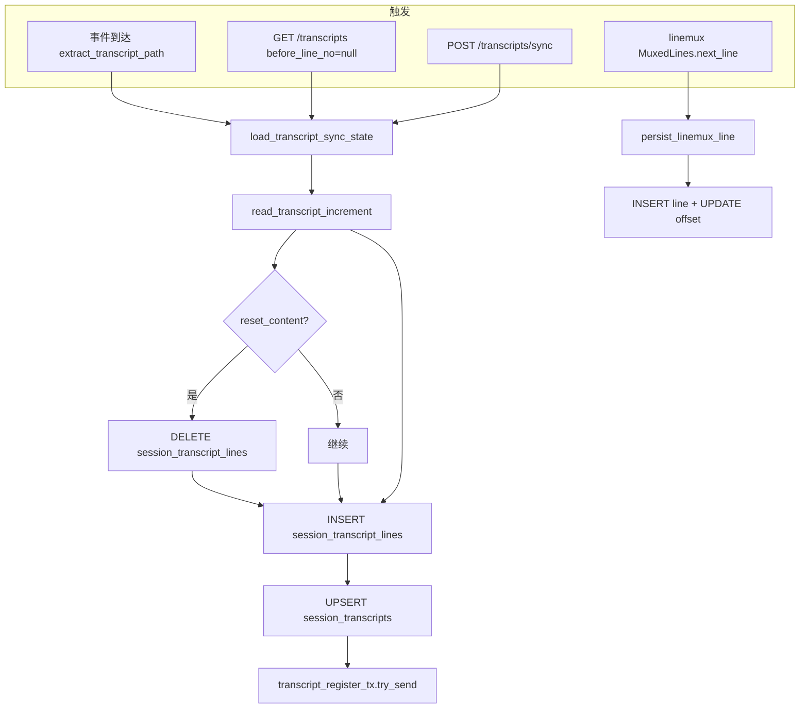

---

## 5. LLM 评估

**业务目标**：对 AI Agent 会话中的关键事件进行自动化风险评估与效率分析。

### 核心实体

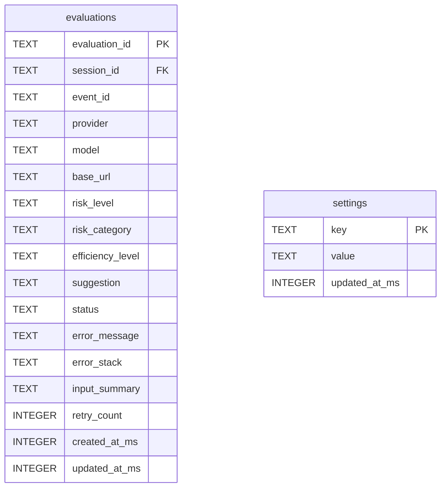

**索引**：`idx_evaluations_session_time (session_id, created_at_ms DESC)`

### 枚举/状态说明

| 枚举/状态 | 取值 | 说明 |
|-----------|------|------|
| status | `success`, `failed` | 评估结果状态 |
| risk_level | `high`, `medium`, `low`, `unknown` | 风险等级 |
| provider | `openai`, `anthropic`, `ollama` | 评估提供商 |
| error_type | `config`, `auth`, `rate_limit`, `network`, `network_timeout`, `parse`, `provider` | 错误分类 |

### 服务类与关键方法

| 模块 | 方法 | 职责 |
|------|------|------|
| `evaluation.rs` | `evaluate(input, config) -> Result<StructuredEvaluation, String>` | 根据 provider 调用对应 Provider 实现 |
| `evaluation.rs` | `Provider` trait | 抽象评估提供商（OpenAiProvider、AnthropicProvider、OllamaProvider） |
| `evaluation.rs` | `EvalConfig` | 评估配置（enabled, sampling_rate, provider, model, base_url, api_key, timeout_ms） |
| `eval_queue.rs` | `enqueue_for_worker()` | 根据配置判断是否入队，采样率控制 |
| `eval_queue.rs` | `spawn_evaluation_worker()` | 启动异步 worker，消费队列并调用 evaluate |
| `eval_queue.rs` | `process_evaluation_job()` | 处理单条评估任务，写入 evaluations 表 |
| `db.rs` | `load_eval_config()` | 从 settings 表加载 EvalConfig |
| `db.rs` | `persist_eval_config()` | 将 EvalConfig 持久化到 settings 表 |
| `handlers.rs` | `get_settings` / `save_settings` | GET/POST `/settings` |
| `handlers.rs` | `get_evaluations` / `retry_evaluation` | GET `/evaluations`、POST `/evaluations/retry` |

### 数据存储映射

**evaluations 表**：见核心实体 ER 图

**settings 表中的评估配置键**：

| key | 说明 |
|-----|------|
| eval_enabled | 是否启用评估 |
| eval_sampling_rate | 采样率 (0.0-1.0) |
| eval_provider | 提供商 (openai/anthropic/ollama) |
| eval_model | 模型名称 |
| eval_base_url | API 基础 URL |
| eval_api_key | API 密钥 |
| eval_timeout_ms | 超时时间（毫秒） |

### 对外接口清单

| 方法 | 路径 | 参数 | 响应 |
|------|------|------|------|
| GET | `/settings` | 无 | `EvalConfig` |
| POST | `/settings` | `EvalConfig` | `EvalConfig` |
| GET | `/evaluations` | session_id, from_ms?, to_ms?, page?, page_size? | `EvaluationQueryResponse` |
| POST | `/evaluations/retry` | `{ evaluation_id }` | `ApiErrorBody` |

### 依赖的外部服务

| 服务 | 用途 | 配置来源 |
|------|------|----------|
| OpenAI API | gpt-4o-mini 等模型评估 | eval_provider=openai, eval_api_key, eval_base_url |
| Anthropic API | claude-3-7-sonnet 等模型评估 | eval_provider=anthropic, eval_api_key, eval_base_url |
| Ollama | 本地模型评估 | eval_provider=ollama, eval_base_url（默认 http://127.0.0.1:11434/api） |

### 业务流程图

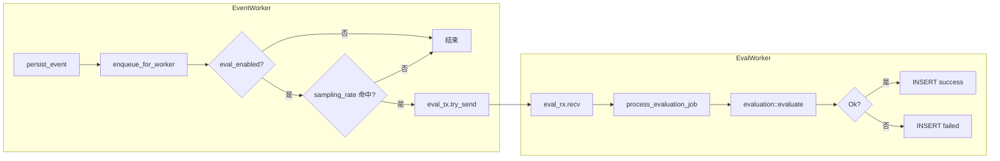

---

## 6. Hooks 管理

**业务目标**：管理 Claude Code 的 Hooks 配置，使 Agent 在特定事件发生时自动执行用户指定的命令。

### 核心实体

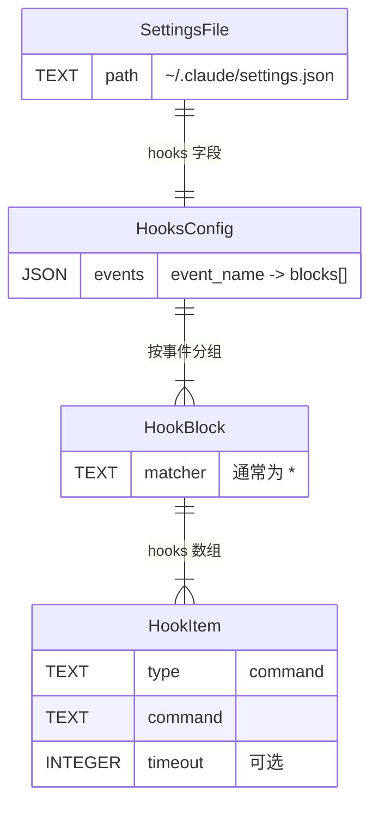

### 枚举/状态说明

| 枚举/类型 | 取值 | 说明 |
|-----------|------|------|
| TARGET_EVENTS | PermissionRequest, Notification, Stop, SubagentStop, SessionStart, SessionEnd, PreToolUse, PostToolUse, UserPromptSubmit | 初始化时预设的事件类型 |
| matcher | `*` | 通配匹配 |
| type | `command` | Hook 类型，执行 shell 命令 |

### 服务类与关键方法

| 模块 | 方法 | 职责 |
|------|------|------|
| `hooks.rs` | `get_hooks() -> Result<HooksResponse>` | 读取 `~/.claude/settings.json`，提取 hooks 对象 |
| `hooks.rs` | `save_hooks(payload) -> Result<HooksResponse>` | 将 payload.events 合并到 settings，备份后写入 |
| `hooks.rs` | `init_hooks() -> Result<HooksInitResponse>` | 为 TARGET_EVENTS 各事件添加 report_event 命令 |
| `hooks.rs` | `report_event_command()` | 解析 report_event.py 路径，生成 `python3 <path>` 命令 |
| `handlers.rs` | `get_hooks` / `save_hooks` / `init_hooks` | GET/POST `/hooks`、POST `/hooks/init` |

### 数据存储映射

| 存储 | 结构 | 说明 |
|------|------|------|
| `~/.claude/settings.json` | `{ "hooks": { "EventName": [{ "matcher": "*", "hooks": [{ "type": "command", "command": "..." }] }] } }` | Claude 官方 hooks 格式 |

### 对外接口清单

| 方法 | 路径 | 参数 | 响应 |
|------|------|------|------|
| GET | `/hooks` | 无 | `HooksResponse` |
| POST | `/hooks` | `HooksResponse` | `HooksResponse` |
| POST | `/hooks/init` | 无 | `HooksInitResponse` (events, added_count) |

### 依赖的外部服务

| 依赖 | 说明 |
|------|------|
| `~/.claude/settings.json` | Claude Code 用户级配置文件 |
| `hooks/report_event.py` | Python 脚本，通过 stdin 接收事件，POST 到 `/events` |
| `CODE_AGENT_OVERSEER_ENDPOINT` | 环境变量，默认 `http://127.0.0.1:8787/events` |

### 业务流程图

```mermaid
flowchart TD
    subgraph InitHooks
        A["POST /hooks/init"] --> B[load_settings_file]
        B --> C["report_event_command 解析路径"]
        C --> D["遍历 TARGET_EVENTS"]
        D --> E{"matcher=* 块存在?"}
        E -->|否| F[创建新块]
        E -->|是| G[取现有块]
        F --> H["添加 command hook"]
        G --> I{"command 已存在?"}
        I -->|否| H
        I -->|是| J[跳过]
        H --> K[backup_file]
        K --> L[write_settings_file]
    end

    subgraph SaveHooks
        M["POST /hooks"] --> N[load_settings_file]
        N --> O["obj.insert hooks"]
        O --> P[backup_file]
        P --> Q[write_settings_file]
    end

    subgraph ReportEvent["运行时"]
        R["Claude 触发事件"] --> S["执行 hooks 中的 command"]
        S --> T[report_event.py]
        T --> U["build_payload from stdin"]
        U --> V["POST /events"]
    end
```

---

## 7. Cursor AI 追踪

**业务目标**：基于 Cursor 编辑器自身维护的代码追踪数据，为开发者提供 AI 辅助编程的量化洞察。

### 核心实体

| 实体 | 说明 |
|------|------|
| `ScoredCommit` | 单次评分提交，含 commitHash、branchName、linesAdded/Deleted、tabLines、composerLines、humanLines、blankLines、commitMessage、commitDate、ai_percentage |
| `ScoredCommitsResponse` | 分页响应：items、total、page、page_size |
| `AiTrackingStats` | 整体统计：total_commits、total_lines_added/deleted、total_ai_lines、total_human_lines、avg_ai_percentage、model_distribution |
| `ModelStat` | 模型统计：model、code_count |

### 服务类与关键方法

| 模块 | 方法 | 说明 |
|------|------|------|
| `cursor_ai_tracking` | `tracking_db_path()` | 返回 `~/.cursor/ai-tracking/ai-code-tracking.db` 路径 |
| `cursor_ai_tracking` | `open_tracking_db()` | 以只读模式打开 Cursor 追踪库 |
| `cursor_ai_tracking` | `query_scored_commits(page, page_size)` | 分页查询 scored_commits，按 scoredAt DESC |
| `cursor_ai_tracking` | `query_ai_code_stats()` | 聚合 scored_commits 与 ai_code_hashes |
| `handlers` | `get_ai_tracking_commits` / `get_ai_tracking_stats` | GET `/cursor/ai-tracking/commits` / `stats` |

### 数据存储映射

| 数据源 | 路径 | 访问模式 |
|--------|------|----------|
| Cursor 追踪库 | `~/.cursor/ai-tracking/ai-code-tracking.db` | 只读 |

| 表 | 关键字段 |
|----|---------|
| `scored_commits` | commitHash, branchName, linesAdded, linesDeleted, tabLinesAdded/Deleted, composerLinesAdded/Deleted, humanLinesAdded/Deleted, blankLinesAdded/Deleted, commitMessage, commitDate, v2AiPercentage |
| `ai_code_hashes` | model, source（用于模型分布，过滤 source != 'human'） |

### 对外接口清单

| 方法 | 路径 | 查询参数 | 响应 |
|------|------|----------|------|
| GET | `/cursor/ai-tracking/commits` | page, page_size | `ScoredCommitsResponse` |
| GET | `/cursor/ai-tracking/stats` | 无 | `AiTrackingStats` |

### 依赖的外部服务

- **Cursor 编辑器**：维护 `~/.cursor/ai-tracking/ai-code-tracking.db`，本应用仅读取

### 业务流程图

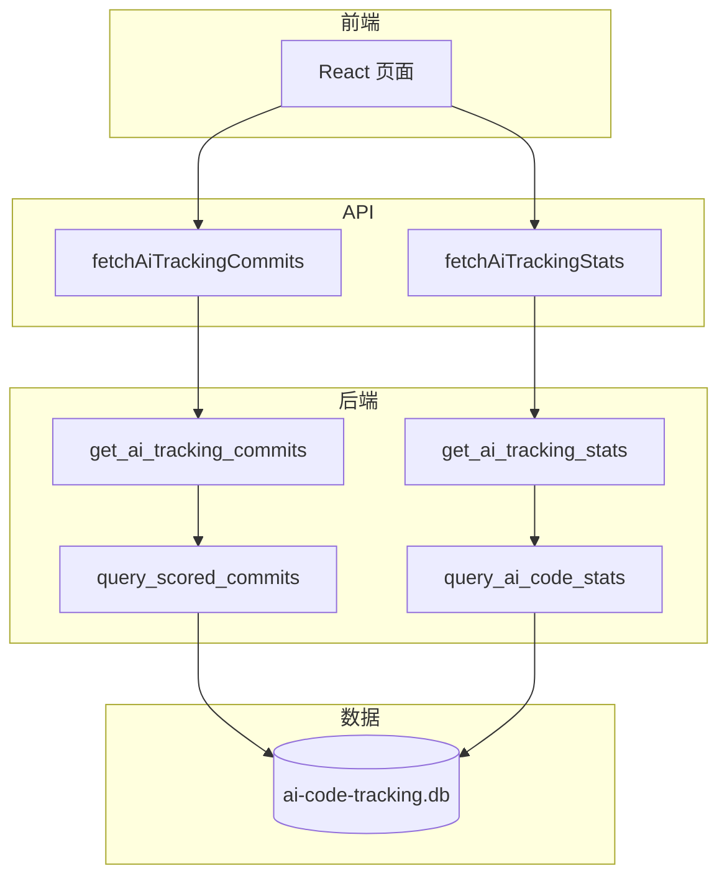

---

## 8. 应用配置与启动

**业务目标**：在应用启动时正确加载配置、初始化数据存储与后台服务，并建立 HTTP 接口。

### 核心实体

| 实体 | 说明 |
|------|------|
| `AppConfig` | 应用配置，含 `db_path` |
| `AppState` | 全局状态：`db`, `eval_tx`, `event_tx`, `eval_counter`, `eval_config_cache`, `transcript_register_tx` |

### 服务类与关键方法

| 模块 | 方法/类型 | 说明 |
|------|-----------|------|
| `lib.rs` | `run()` | Tauri 入口：refresh_path → load_config → spawn HTTP Server → Tauri Builder |
| `lib.rs` | `http_server_addr()` | 从 `CLAUDE_CODE_LAUNCH_PORT` 解析端口，默认 8787 |
| `app_config` | `resolve_config_path()` | 优先 `CLAUDE_CODE_LAUNCH_CONFIG_PATH`，否则 `~/.config/claude-code-launch/config.json` |
| `app_config` | `load_app_config()` | 读取 JSON，解析 db_path，支持 `~` 展开 |
| `collection` | `AppState::new(db_path)` | 打开 SQLite、初始化 schema、创建 channel、spawn 后台 worker |
| `collection` | `serve(addr, db_path)` | 构建 Router、绑定 TcpListener、Axum serve |
| `collection` | `build_router(state)` | 注册所有路由与 CORS |
| `local_api` | `main()` | 独立二进制：load_app_config → collection::serve，不启动 Tauri |

### 数据存储映射

| 配置项 | 路径/来源 | 说明 |
|--------|----------|------|
| 配置文件 | `~/.config/claude-code-launch/config.json` 或 `CLAUDE_CODE_LAUNCH_CONFIG_PATH` | JSON，含 db_path |
| 默认 db_path | `runtime/claude-code-launch.sqlite3` | 相对当前工作目录 |
| 数据库 | 由 db_path 指定 | SQLite，应用主库 |

### 后台进程

| 进程 | 说明 |
|------|------|
| `spawn_event_worker` | 消费 event_rx，持久化事件、触发转录同步、入队评估 |
| `spawn_evaluation_worker` | 消费 eval_rx，执行评估并写入 evaluations 表 |
| `spawn_transcript_watcher` | 消费 transcript_register_rx，linemux 监听转录文件增量导入 |

### 环境变量

| 变量 | 用途 | 默认值 |
|------|------|--------|
| `CLAUDE_CODE_LAUNCH_CONFIG_PATH` | 覆盖配置文件路径 | `~/.config/claude-code-launch/config.json` |
| `CLAUDE_CODE_LAUNCH_PORT` | HTTP 服务端口 | 8787 |
| `CODE_AGENT_OVERSEER_ALLOWED_ORIGINS` | CORS 额外允许来源 | — |
| `VITE_API_BASE_URL` | 前端 API 基地址 | `http://127.0.0.1:8787` |

### 业务流程图

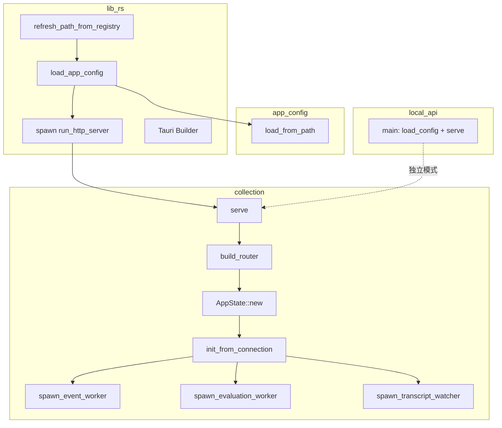

---

## 9. Python Hooks 脚本

**业务目标**：将 Claude Code / Cursor 的 Hook 事件上报到监控服务，并支持 Hook 配置初始化。

### 核心实体

| 实体 | 说明 |
|------|------|
| 事件负载 | event_id、session_id、project_name、event_type、payload、created_at_ms |
| payload | raw_stdin、stdin_json、original_hook_event_name、cwd、has_api_key、timestamp |

### 服务类与关键方法

| 文件 | 方法 | 说明 |
|------|------|------|
| `report_event.py` | `read_stdin_utf8()` | 从 stdin 读取 UTF-8 文本 |
| `report_event.py` | `parse_stdin_json()` | 解析 JSON，空或非法返回 {} |
| `report_event.py` | `derive_project_name()` | 从 stdin_json/cwd/workspace_roots 推导项目名 |
| `report_event.py` | `build_payload()` | 构造完整事件负载 |
| `report_event.py` | `endpoints()` | 从 `CODE_AGENT_OVERSEER_ENDPOINTS`/`ENDPOINT` 解析端点列表 |
| `report_event.py` | `report_with_retry()` | 带指数退避的重试 POST |
| `report_event.py` | `main()` | 默认异步（后台线程），`CODE_AGENT_HOOK_SYNC=1` 时同步 |
| `init_hooks.py` | `parse_args()` | `--target repo|user`、`--config`、`--dry-run` |
| `init_hooks.py` | `resolve_config_path()` | user: `~/.claude/settings.json`；repo: `.claude/settings.json` |
| `init_hooks.py` | `merge_target_events()` | 将 TARGET_EVENTS 的 command hook 合并到 settings |
| `init_hooks.py` | `main()` | 加载、合并、备份、写入 settings |

### 数据存储映射

| 类型 | 路径 | 说明 |
|------|------|------|
| 用户 settings | `~/.claude/settings.json` | `--target user` |
| 仓库 settings | `<repo_root>/.claude/settings.json` | `--target repo` |
| 备份 | `settings.json.bak.<timestamp>` | 写入前备份 |

### 对外接口清单

| 脚本 | 调用方式 | 环境变量 |
|------|----------|----------|
| `report_event.py` | `python3 hooks/report_event.py`，stdin 传入 JSON | CODE_AGENT_OVERSEER_ENDPOINT, CODE_AGENT_OVERSEER_ENDPOINTS, CODE_AGENT_HOOK_RETRY_ATTEMPTS, CODE_AGENT_HOOK_BACKOFF_SECONDS, CODE_AGENT_HOOK_TIMEOUT_SECONDS, CODE_AGENT_HOOK_SYNC, CODE_AGENT_HOOK_VERBOSE, CLAUDE_SESSION_ID, CLAUDE_PROJECT_NAME, CLAUDE_HOOK_EVENT_NAME |
| `init_hooks.py` | `python3 hooks/init_hooks.py [--target user|repo] [--dry-run]` | 无 |

### 依赖的外部服务

- **监控服务**：POST `/events` 的 HTTP 端点，默认 `http://127.0.0.1:8787/events`
- **Claude/Cursor**：通过 settings.json 的 hooks 配置调用 report_event.py

### 业务流程图

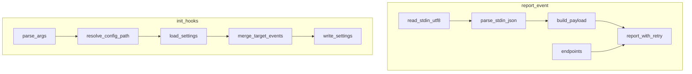

---

## 技术约束与扩展点

### 新增业务域的标准步骤

1. **后端**：在 `src-tauri/src/collection/` 下新增模块文件
2. **路由**：在 `collection.rs` 的 `build_router()` 中注册路由
3. **Handler**：在 `collection/handlers.rs` 中添加 handler 函数
4. **数据库**：在 `collection/db.rs` 的 `init_schema()` 中添加建表语句
5. **前端 API**：在 `src/api.ts` 中添加 fetch 函数
6. **前端 Hook**：在 `src/hooks/` 下新增 `useXxx.ts`
7. **前端页面**：在对应的 Page 组件中集成

### 数据存储选择原则

| 场景 | 存储方式 |
|------|---------|
| 业务数据（会话、事件、评估） | SQLite（应用主库） |
| 配置数据 | SQLite settings 表（KV 格式） |
| Claude Hook 配置 | `~/.claude/settings.json`（Claude 官方格式） |
| 外部只读数据 | 直接打开外部 SQLite（如 Cursor AI 追踪库） |
| 临时/实时数据 | Tauri Event（日志推送）、mpsc channel（内部队列） |

### 异步处理模式

- **事件处理**：`mpsc::channel` + `spawn_event_worker`，单 worker 顺序消费
- **评估处理**：`mpsc::channel` + `spawn_evaluation_worker`，单 worker 顺序消费
- **文件监听**：`linemux::MuxedLines` + `spawn_transcript_watcher`，注册/注销通过 channel

### CORS 配置

- 默认允许来源：`http://localhost:1420`, `http://127.0.0.1:1420`, `tauri://localhost`
- 可通过 `CODE_AGENT_OVERSEER_ALLOWED_ORIGINS` 环境变量扩展
- 允许方法：GET, POST, OPTIONS
- 允许头：Content-Type

### SQLite 配置

- `PRAGMA journal_mode = WAL`（并发读写）
- `PRAGMA busy_timeout = 5000`（锁等待 5 秒）
