# Claude Code Launch 领域模型

> **文档定位**：用纯粹的业务语言描述系统做什么、有哪些核心概念、提供什么能力。面向外部业务方、接入方、产品经理。
>
> 技术实现细节请参阅 [架构设计文档](./architecture-design.md)。

---

## 通用语言表

| 术语 | 定义 |
|------|------|
| 安装向导 | 引导用户一键完成 Claude Code 安装的交互流程，包括环境检测、安装执行、验证三个步骤 |
| 会话 | AI Agent（Claude Code 或 Cursor）与用户的一次交互过程，包含项目、时长、Token 等元信息 |
| 事件 | Agent 会话中的关键动作记录，如工具调用、命令执行、权限请求等 |
| Transcript | Agent 会话的完整对话记录，以行为单位存储的结构化日志 |
| 评估 | 使用大语言模型对事件进行风险等级和效率分析的过程 |
| Hook | Claude Code 在特定事件触发时自动执行的命令，用于实现事件上报等自动化 |
| 评分提交 | 一次 Git 提交，附带 AI 代码行数占比等统计信息 |
| 发现 | 扫描本地文件系统，识别并导入 Claude Code / Cursor 的历史会话 |
| 归档 | 将会话的事件标记为不再展示，但保留历史数据 |
| 采样率 | 控制事件被送入 LLM 评估的概率比例 |

---

## 领域概念关系总览

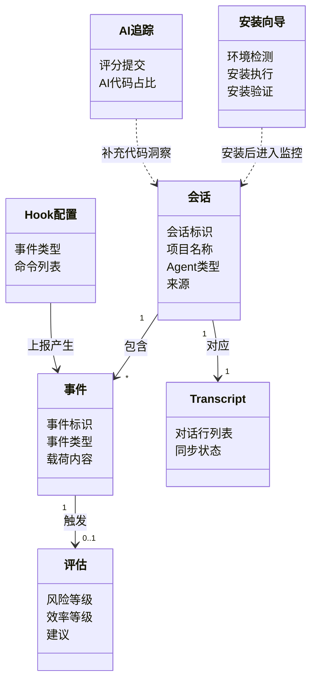

---

## 1. 安装向导

**业务目标**：帮助用户一键完成 Claude Code 的安装与验证，降低安装门槛，保证环境可用。

### 核心概念模型

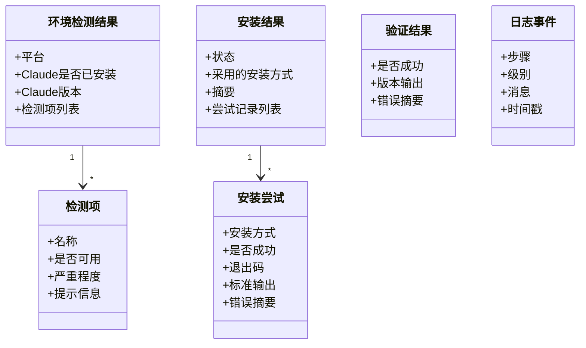

### 业务能力与用例

| 能力 | 描述 |
|------|------|
| 环境检测 | 检测当前平台、npm 是否可用、Claude 是否已安装及版本；Windows 下额外检测 Git 建议 |
| 一键安装 | 在 npm 可用时执行全局安装；Windows 下若 npm 不可用则自动安装 Node.js MSI，再执行安装 |
| 安装验证 | 执行 `claude --version` 校验安装是否成功 |
| 实时日志 | 安装与验证过程中通过事件推送日志，供界面实时展示 |

### 业务流程图

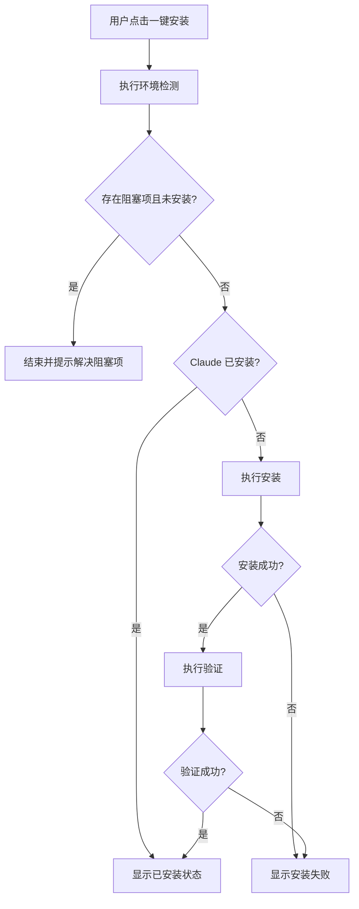

### 对外 API 契约

| 接口 | 功能 | 参数 | 返回值 |
|------|------|------|--------|
| 环境检测 | 检查平台与前置条件 | 无 | 环境检测结果（平台、Claude 状态、检测项列表） |
| 执行安装 | 一键安装 Claude Code | 无 | 安装结果（状态、摘要、尝试记录）；过程中推送实时日志 |
| 执行验证 | 校验安装是否成功 | 无 | 验证结果（是否成功、版本输出、错误摘要）；过程中推送实时日志 |

---

## 2. 会话管理

**业务目标**：统一管理 Claude Code 与 Cursor 的 AI Agent 会话，支持发现历史会话、查看详情、归档，便于监控与分析。

### 核心概念模型

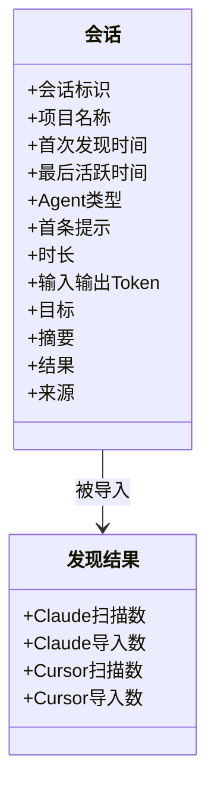

### 业务能力与用例

| 能力 | 描述 |
|------|------|
| 会话列表 | 按项目分组展示会话，支持按最后活跃时间排序，展示 Agent 类型、时长、Token 等 |
| 发现历史 | 扫描 Claude Code 与 Cursor 本地数据，导入或更新历史会话 |
| 会话归档 | 将指定会话的事件标记为已归档，并清理关联的 Transcript 路径 |
| 会话详情 | 展示目标、结果、摘要、时长、Token 等，并支持查看 Transcript 与事件 |

### 业务流程图

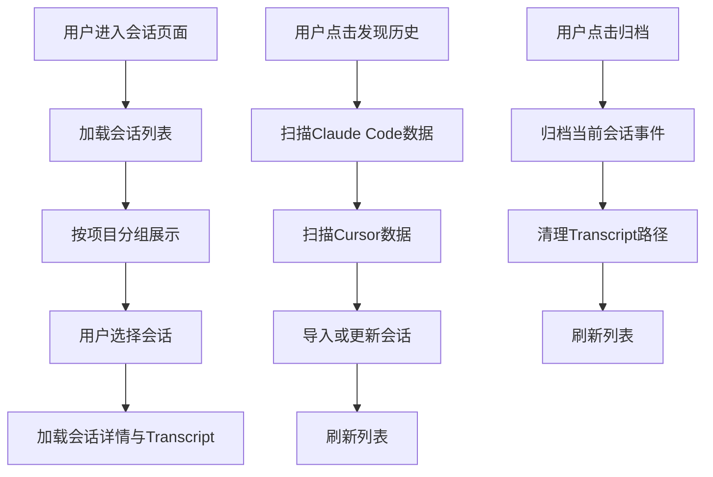

### 对外 API 契约

| 能力 | 方法 | 路径 | 说明 |
|------|------|------|------|
| 获取会话列表 | GET | /sessions | 返回有事件或来自发现的会话列表，含评估统计与风险等级 |
| 发现历史会话 | POST | /sessions/discover | 扫描 Claude Code 与 Cursor 本地数据，导入或更新会话 |
| 归档会话 | POST | /sessions/archive | 归档指定会话的事件并清理 Transcript 路径 |

---

## 3. 事件采集

**业务目标**：采集并持久化 AI Agent 会话中的各类事件（如工具调用、命令执行等），为会话监控、风险评估和审计提供数据基础。

### 核心概念模型

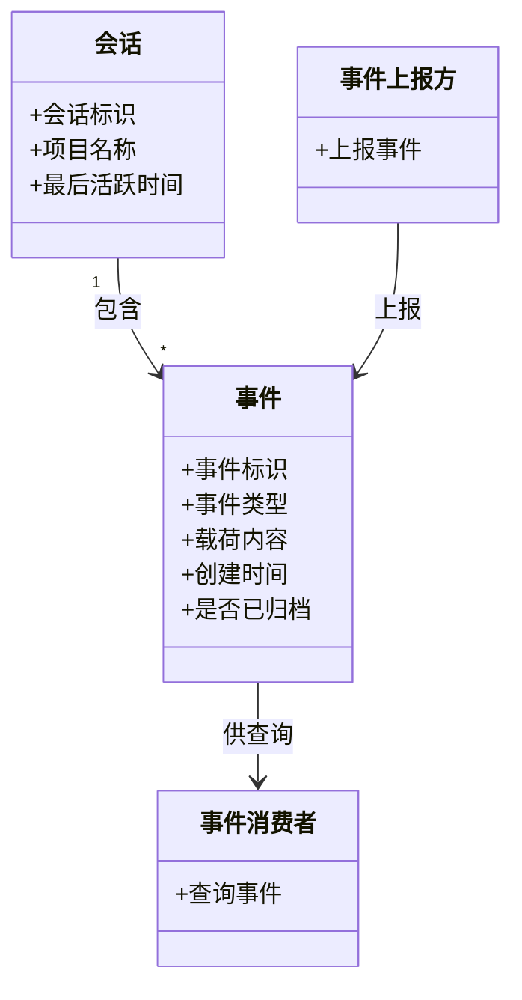

### 业务能力与用例

| 能力 | 描述 |
|------|------|
| 事件上报 | 外部客户端（如 Python Hook）通过 HTTP 接口上报事件，系统校验必填字段、对敏感字段脱敏后入库 |
| 事件查询 | 按会话、时间范围、事件类型筛选，支持分页 |
| 事件归档 | 对会话进行归档后，其历史事件不再对外展示，新事件仍可继续上报 |
| 下游联动 | 事件入库后自动触发 Transcript 同步与 LLM 评估入队 |

### 业务流程图

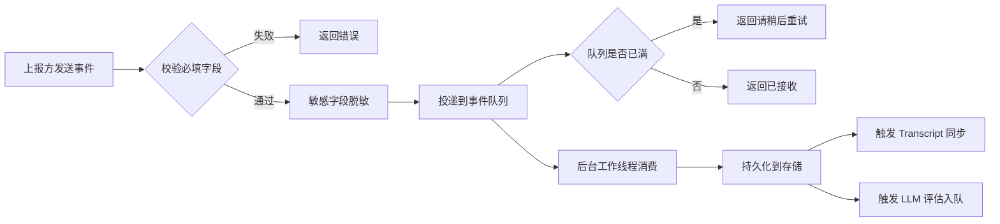

### 对外 API 契约

| 能力 | 方法 | 路径 | 说明 |
|------|------|------|------|
| 上报事件 | POST | /events | 提交事件（含事件标识、会话标识、项目名、事件类型、载荷、创建时间），返回是否接收 |
| 查询事件 | GET | /events | 按会话标识分页查询，可选时间范围和事件类型过滤 |

---

## 4. Transcript 同步

**业务目标**：将 AI Agent 会话的对话记录（Transcript）从本地 JSONL 文件同步到应用内，支持实时更新与历史回溯，为会话监控提供完整对话内容。

### 核心概念模型

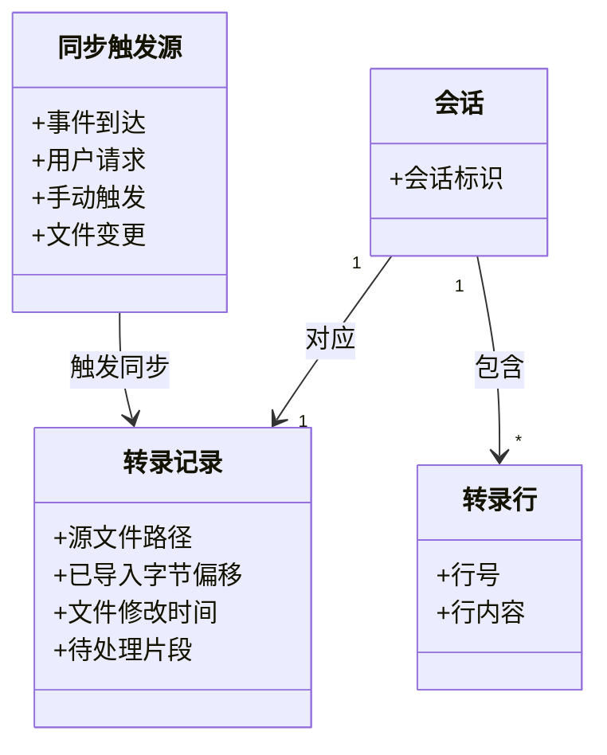

### 业务能力与用例

| 能力 | 描述 |
|------|------|
| 增量同步 | 从上次偏移位置继续读取文件，按行解析并入库，支持 UTF-8 多字节字符边界 |
| 文件变更检测 | 通过文件大小、修改时间判断是否被截断或重写，必要时重置并全量重导 |
| 实时监听 | 使用文件系统事件监听，新写入行即时入库 |
| 分页查询 | 按行号游标分页，支持加载更早内容 |

### 业务流程图

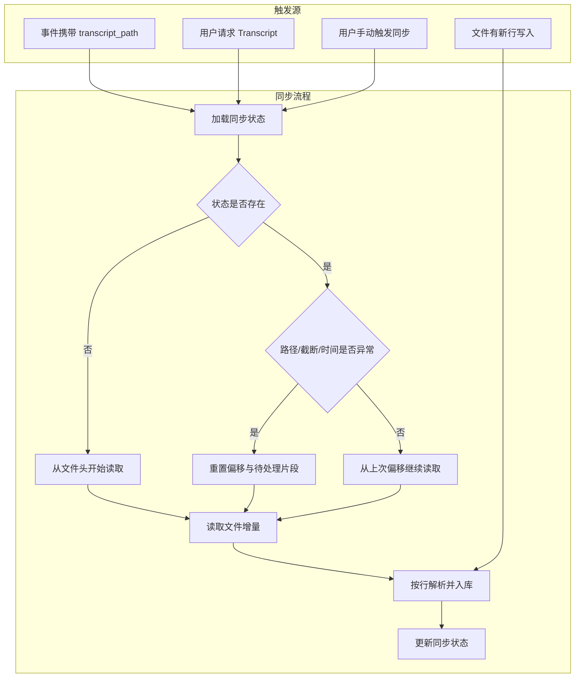

### 对外 API 契约

| 能力 | 方法 | 路径 | 说明 |
|------|------|------|------|
| 查询 Transcript | GET | /transcripts | 按会话标识分页查询，支持行号游标和每页行数 |
| 手动同步 | POST | /transcripts/sync | 指定会话标识，从源文件增量读取并入库 |

---

## 5. LLM 评估

**业务目标**：对 AI Agent 会话中的关键事件进行自动化风险评估与效率分析，帮助用户识别高风险操作、低效行为，并获得改进建议。

### 核心概念模型

- **评估任务**：针对某次会话中的某个事件，调用大语言模型进行结构化分析，产出风险等级、风险类别、效率等级和优化建议。
- **评估配置**：控制评估是否启用、采样比例、使用的模型提供商、模型名称、API 地址、密钥和超时时间。
- **评估结果**：包含风险等级（如 high/medium/low）、风险类别、效率等级、以及面向用户的改进建议。
- **评估记录**：每次评估任务的持久化结果，包含成功/失败状态、错误信息、重试次数等。

### 业务能力与用例

| 能力 | 描述 |
|------|------|
| 自动评估 | 事件入库后按配置自动触发评估（采样率控制） |
| 配置管理 | 启用/禁用评估、选择提供商（OpenAI/Anthropic/Ollama）、设置采样率等 |
| 结果查询 | 按会话分页查询评估记录 |
| 失败重试 | 对失败的评估任务发起重试 |

### 业务流程图

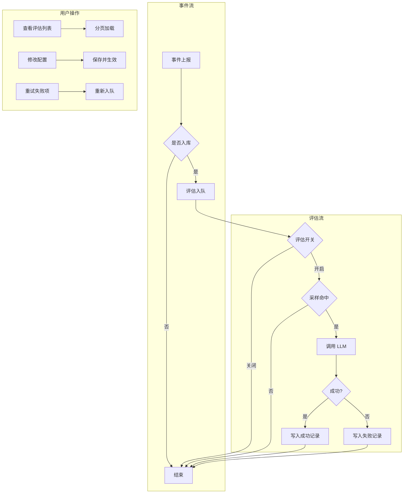

### 对外 API 契约

| 能力 | 方法 | 路径 | 说明 |
|------|------|------|------|
| 获取评估配置 | GET | /settings | 返回当前评估配置（启用状态、提供商、模型、采样率等） |
| 保存评估配置 | POST | /settings | 提交配置并持久化，立即生效 |
| 查询评估列表 | GET | /evaluations | 按会话标识分页查询，支持时间范围过滤 |
| 重试评估 | POST | /evaluations/retry | 对指定评估记录重新发起评估 |

---

## 6. Hooks 管理

**业务目标**：管理 Claude Code 的 Hooks 配置，使 Agent 在特定事件发生时自动执行用户指定的命令（如事件上报脚本），实现与监控系统的集成。

### 核心概念模型

- **事件类型**：Claude Code 在运行过程中触发的生命周期事件，如 SessionStart、SessionEnd、PreToolUse、PostToolUse、UserPromptSubmit 等。
- **Hook 块**：针对某事件类型的配置单元，包含匹配规则和命令列表。
- **Hook 命令**：在事件触发时执行的命令，通常为调用上报脚本的形式。
- **Hooks 配置**：以事件类型为键、Hook 块数组为值的结构，持久化在 Claude 的 settings 文件中。

### 业务能力与用例

| 能力 | 描述 |
|------|------|
| 读取配置 | 从 Claude settings 中读取当前 Hooks 配置 |
| 保存配置 | 将修改后的 Hooks 写回 settings 文件 |
| 一键初始化 | 为预设事件类型批量注册上报脚本 |
| 添加/删除命令 | 在某个事件的 Hook 块中增删命令 |

### 业务流程图

```mermaid
flowchart TD
    subgraph InitFlow["初始化流程"]
        A[用户点击一键初始化] --> B[读取 settings]
        B --> C[为预设事件添加上报命令]
        C --> D[备份原文件]
        D --> E[写入新配置]
        E --> F[返回新增数量]
    end

    subgraph EditFlow["编辑流程"]
        G[用户添加/删除事件或命令] --> H[前端更新状态]
        H --> I[用户点击保存]
        I --> J[提交配置]
        J --> K[读取 settings]
        K --> L[合并 hooks 配置]
        L --> M[备份并写入]
    end

    subgraph RuntimeFlow["运行时"]
        N[Claude 触发事件] --> O[执行该事件的 hooks]
        O --> P[上报脚本运行]
        P --> Q[POST /events]
    end
```

### 对外 API 契约

| 能力 | 方法 | 路径 | 说明 |
|------|------|------|------|
| 获取 Hooks | GET | /hooks | 返回当前 settings 中的 hooks 配置 |
| 保存 Hooks | POST | /hooks | 提交完整 hooks 配置并写回 settings |
| 初始化 Hooks | POST | /hooks/init | 为预设事件批量注册上报命令，返回新增数量 |

---

## 7. Cursor AI 追踪

**业务目标**：基于 Cursor 编辑器自身维护的代码追踪数据，为开发者提供 AI 辅助编程的量化洞察，包括提交级别的 AI 代码占比、模型使用分布等统计，帮助团队了解 AI 在代码产出中的贡献度。

### 核心概念模型

| 概念 | 说明 |
|------|------|
| 评分提交 | 一次 Git 提交，附带按行数拆分的来源统计（AI 生成 vs 人工编写） |
| AI 代码占比 | 单次提交或整体统计中，AI 生成代码行数占总代码行数的百分比 |
| 模型分布 | 各 AI 模型（如 Tab、Composer 等）生成代码的条数或行数占比 |
| 行数来源 | 代码行按来源分类：Tab 补全、Composer 生成、人工编写、空行 |

### 业务能力与用例

- **查看提交列表**：按时间倒序分页浏览已评分的提交，每项展示分支、增减行数、AI 占比、提交信息
- **查看整体统计**：汇总所有提交的总行数、AI 行数、人工行数、平均 AI 占比及模型分布
- **洞察 AI 贡献**：通过占比与模型分布，评估团队对 AI 辅助编程的依赖程度与模型偏好

### 业务流程图

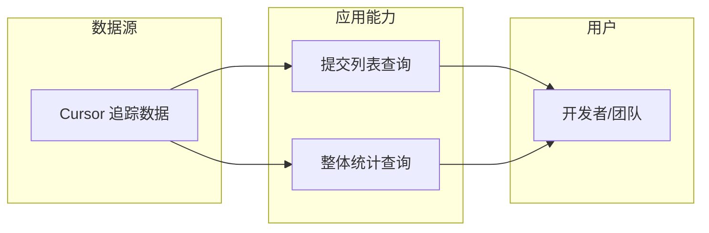

### 对外 API 契约

| 能力 | 方法 | 路径 | 说明 |
|------|------|------|------|
| 获取提交列表 | GET | /cursor/ai-tracking/commits | 分页返回评分提交，含分支、行数、AI 占比 |
| 获取整体统计 | GET | /cursor/ai-tracking/stats | 返回汇总统计和模型分布 |

---

## 8. 应用配置与启动

**业务目标**：在应用启动时正确加载配置、初始化数据存储与后台服务，并建立 HTTP 接口供前端与外部 Hook 调用，支持两种运行模式：带图形界面的完整应用与仅 HTTP 服务的独立模式。

### 核心概念模型

| 概念 | 说明 |
|------|------|
| 应用配置 | 应用运行所需的基础配置，如数据库路径 |
| 启动流程 | 从入口到可用的完整初始化序列：环境准备 → 配置加载 → 服务启动 → 界面就绪 |
| 完整模式 | 启动 Tauri 窗口 + HTTP 服务，面向桌面用户 |
| 独立模式 | 仅启动 HTTP 服务，不显示窗口，面向无头或脚本场景 |

### 业务能力与用例

- **加载配置**：从约定路径或环境变量指定路径读取配置，缺失时创建默认配置
- **启动 HTTP 服务**：在本地端口监听，提供健康检查、会话、事件、评估等 API
- **启动后台工作流**：事件处理、评估任务、Transcript 文件监听等异步任务在后台持续运行
- **独立运行**：通过独立二进制仅启动 HTTP 服务，不启动 Tauri 窗口

### 业务流程图

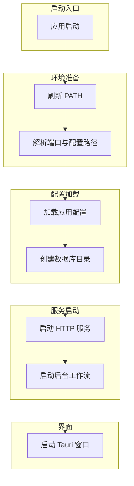

### 对外 API 契约

本域不直接对外暴露业务 API，而是负责将 HTTP 服务与后台工作流启动就绪。对外契约由各业务域 API 定义。

---

## 9. Python Hooks 脚本

**业务目标**：通过 Python 脚本将 Claude Code / Cursor 的 Hook 事件上报到监控服务，并支持一键将 Hook 配置写入 Claude 的 settings，实现「事件产生 → 上报 → 监控」的闭环。

### 核心概念模型

| 概念 | 说明 |
|------|------|
| 事件上报 | 将 Hook 触发时的上下文（会话、项目、事件类型、原始输入等）以 JSON 形式 POST 到监控端点 |
| Hook 初始化 | 将上报脚本注册到 Claude 的 settings，使指定事件触发时自动调用该脚本 |
| 目标范围 | 用户级（~/.claude/settings.json）或仓库级（.claude/settings.json） |

### 业务能力与用例

- **上报事件**：从标准输入读取 JSON，构造事件负载，POST 到配置的端点，支持重试与多端点轮询
- **初始化 Hook**：将上报脚本注册到 settings.json 的指定事件，支持预览（dry-run）
- **冒烟测试**：验证上报、重试、Cursor 格式解析、异步模式等场景

### 业务流程图

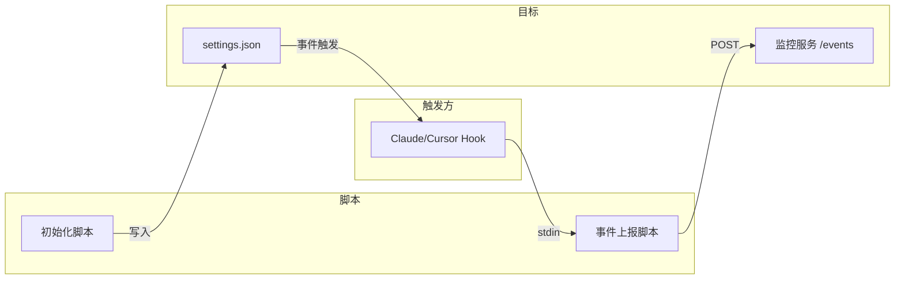

### 对外 API 契约

| 能力 | 输入 | 输出 |
|------|------|------|
| 事件上报 | stdin JSON、环境变量（端点、重试等） | 成功/失败（退出码） |
| Hook 初始化 | 命令行参数（--target user/repo、--dry-run） | 控制台日志、settings 更新或预览 |
